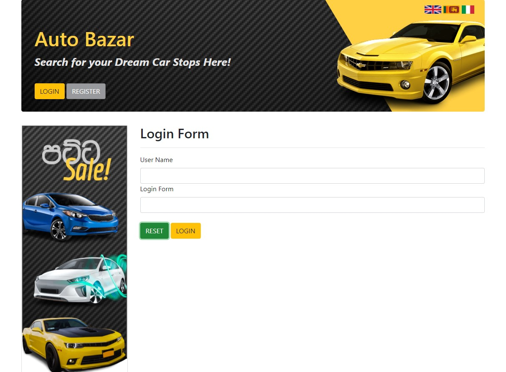
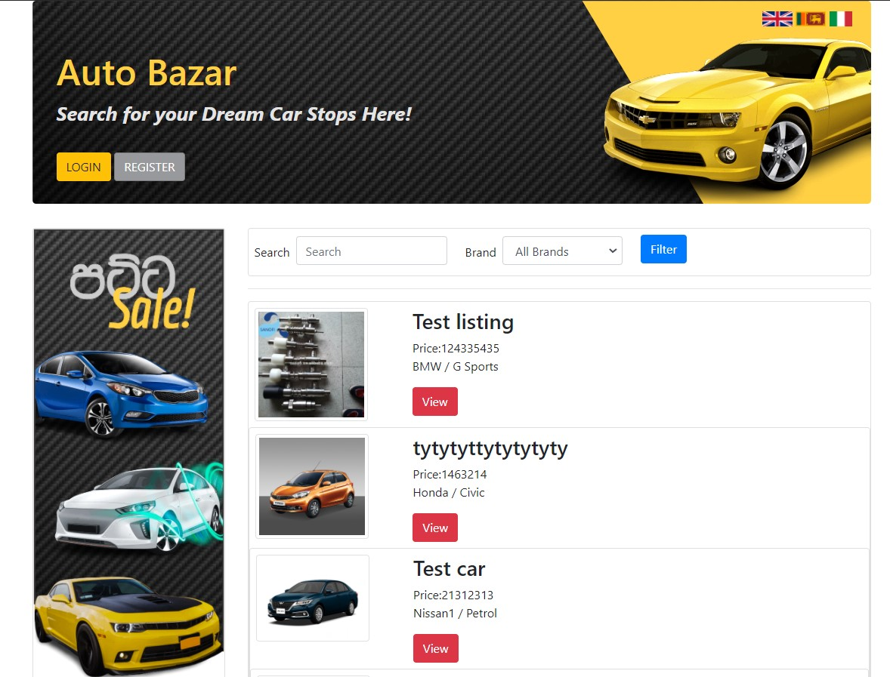
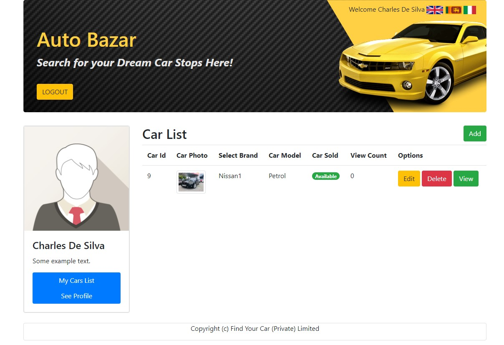
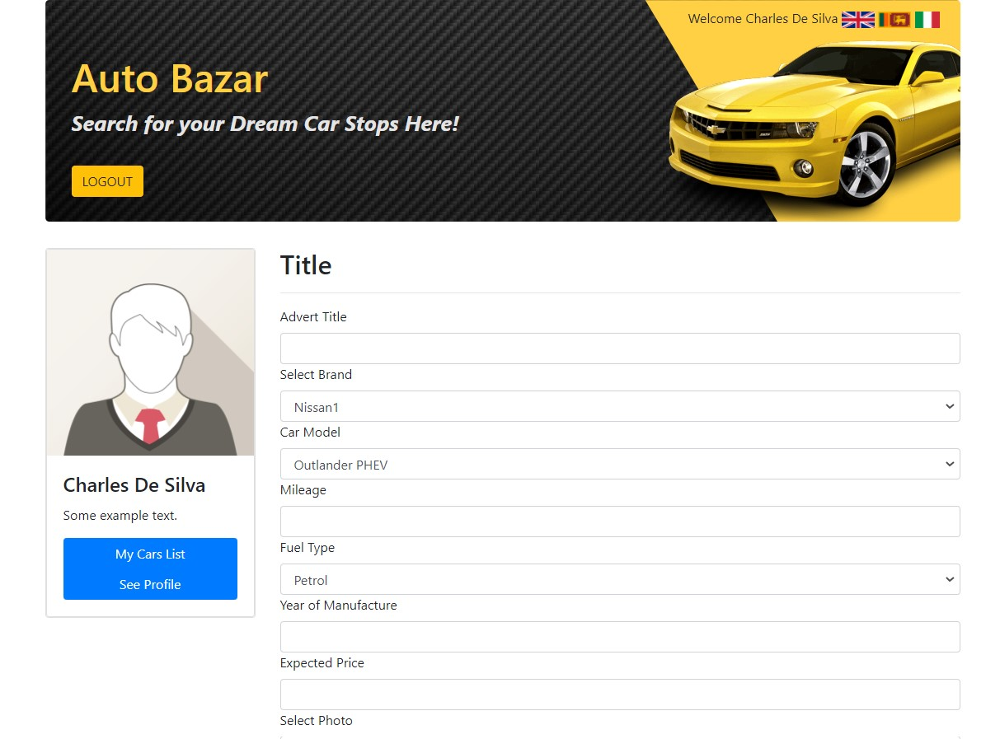
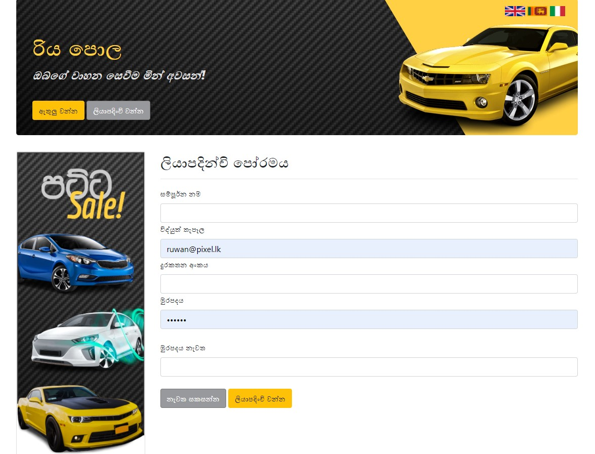

# Car Sale Mockup

## (Sample Car Sale wesite)

## Table of contents

- [General info](#introduction)
- [Screnshots](#screenshots)
- [Features](#features)
- [Technologies](#technologies)
- [Setup](#setup)

## Introduction

This website is done on PHP with the ability fro users to register and add a classifed advertisement on their vehicles for sale.

## Features

- User Registration and Login with OTP verification
- Password encription
- Add / edit / delete classified adverts
- Display classified Adverts
- Picture uploads
- Multi Language support
- MySQL Database

## Technologies

- PHP
- JavaScript (ES6)
- CSS / Bootstrap
- MySQL

## Setup

1. Host the files on a Server
2. Import sql file (dbcarsale.sql) into database on server
3. access index.php on hosted folder root

## Screenshots

